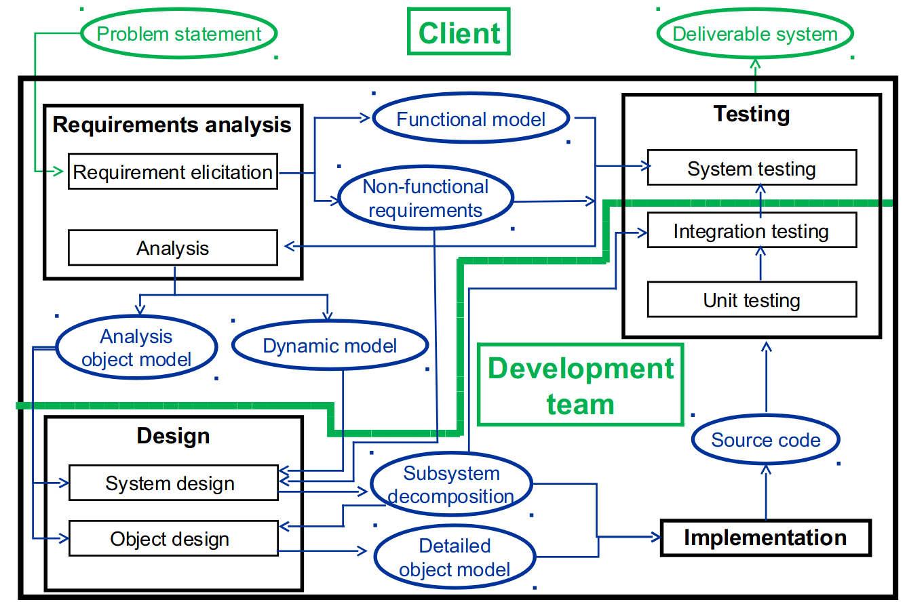
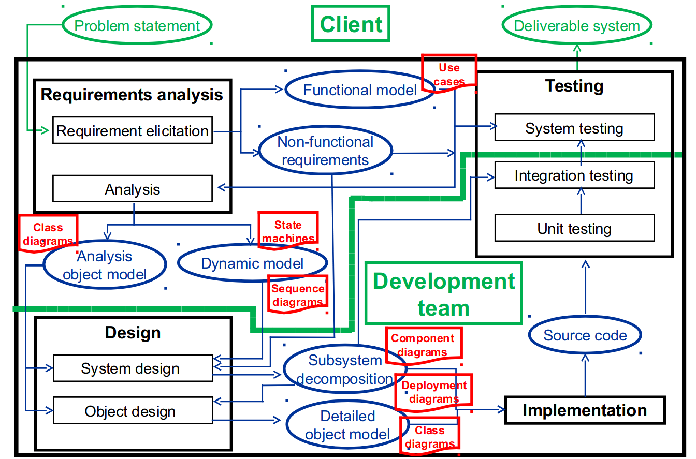

\newpage
\pagestyle{plain}
\tableofcontents
\newpage
\pagestyle{fancy}

# Introduction

## Development Life Cycle

### Requirements Analysis
- requirements
  - functional
  - non-functional
- functional model
- dynamic model
- analysis object model

### High Level System Design
- subsystem decomposition
- system architecture strategies

### Detailed Object Design
- detailed object model
  - class diagrams
- design patterns and contracts

### Implementation
- map associations to
  - collections (easy)
  - storage (hard)

### Testing
- unit testing
- integration testing
- system testing

## Team Work
- we can't each do a part and put it together
- we have to do it all together

## Tools
- VirtualBox
- VM
  - Qt Framework comes with it
  - Dia comes with it
- C++

## Textbook
- textbook is a good indication of how much detail you need for deliverables
  - follow the arena case study
  - perfect level of detail

# Software Engineering Overview

## Definitions

- software engineering
  - software
    - code
    - application
  - engineering
    - technical process for achieving a task
    - building something
  - what **is** software engineering
    - requirements analysis
    - building software
  - what is **not** software engineering
    - building tiny little program
- system
  - what is a system in software engineering?
    - a very **large** piece of software
    - so big, we don't call it
      - a program
      - an application
- we need a **reliable process**
  - a *recipe*
  - why?
  - wanted:
    - **reliable** systems
    - **modifiable** systems
      - we don't want to throw away code to add a new feature
  - we need a **plan**

### The Plan
- two ingredients
  - technical
  - management

#### Technical Aspects
- **understand** the problem
  - *how do we do this?*
  - **ask the client**
- figure out an **optimal solution**

#### Management Aspects
- keep things **on track**
- plan for change
  - *anything can change at any time*

## Technical Aspects

### Application Domain
- **relevant to the problem**
- the *client's world*
- airport example
  - planes
  - runways
  - gates
  - passengers
  - luggage
- we are **not** experts here
  - the *client* is

### Solution Domain
- the **fix** for the problem
- *our* world
- GUI
- design patterns

### Building Models
- what is a model?
- why do we need a model?
- what can go wrong?
- types
  - functional
  - dynamic
  - object

#### The Point of Models
- look at a small scale version
  - don't necessarily build a small scale version
  - look at some different *views* of it
- figure out
  - *how will it work?*

#### Modeling the Application Domain
- requirements analysis
  - **describe** problem to be solved
  - **describe** system requirements
  - **identify** objects required

## Management Aspects
- communication tools
- configuration management
- rationale management
- software development process

### Dealing With Change
- the earlier the better

### The Stakeholders
- client
  - users
  - interacts with
    - project managers
    - requirements team manager
      - QA
- development team
  - project manager
  - architect
  - analyst
  - designers
  - programmers
  - testers
  - operations

## Software Development Phases and Products

\FloatBarrier

# Team Organization

## People Management

- we **all** manage people
  - what others expect of us
  - what we expect of others
- **communication**
  - speak up about issues
- everyone has bad days
  - your own
    - don't be a diva
  - other people's
    - humor and empathy
- **celebrate successes**

### Four Factors in Managing People
- consistency
  - treat others equally
  - equally $\ne$ identically
- respect
  - appreciate different skills
- inclusion
  - listen to all ideas
- honesty
  - about work
  - about skills

### Recipe for Success
- **team meetings** are **essential**
  - Discord
  - in person
- assign people roles that
  - they are **good at**
  - they **enjoy**
- leader works **for** the team
  - encourage
  - motivate
  - listen

## Team Structure

- team leader
- primes (all four people have one or two of these)
  - documentation (ONE or TWO people)
    - documents have consistent formatting
  - requirements (ONE or TWO people)
    - ensure all requirements are documented and traceable
  - architecture/design (ONE or TWO people)
    - ensure design is complete **and optimal**
  - testing (TWO people, MUST pick ANOTHER ROLE)
    - ensure all features match requirements
  - configuration (ONE person ONLY, MUST pick ANOTHER ROLE)
    - ensure deliverable is packed correctly
- coding (all four people are assigned here
  - back end
  - front end

# The Project

## Deliverable 1
- requirements analysis document
  - Christine says she  might scale this slightly back
- implementation of selected features
  - demo

## Deliverable 2
- algorithm design document
  - and **slides** for presentation
  - we **cannot** modify the slides we submit
- in-class presentation
  - on the document/slides we submitted
- implementation of selected features
  - demo

## Deliverable 3
- system design document
- implementation of selected features
  - demo

## Deliverable 4
- document revisions
  - algorithm design document specifically, Christine thinks
- implementation of selected features
  - demo

## Expectations
- **everyone** has to work, **no exceptions**
  - 25% each
- **follow** the **formats discussed in class**
- **end results matter**
  - **not** effort
  - **only** results
- submissions **must** be accompanied by **peer evaluations**
  - grades will be adjusted based on contribution

## System
- Carleton University Animal Care System
  - cuACS

# UML Notation

## UML Overview
- **unified modeling language**
- what is it?
  - a tool for **expressing system models**
    - functional
    - dynamic
    - object

### The UML Family
- each notation is for a **specific model**
- models and notations
    - functional
      - use case diagrams
    - dynamic
      - state machine diagrams
      - sequence diagrams
      - activity diagrams
    - object
      - class diagrams

## Use Case Diagrams
- what is a use case?
  - behavior observed by **external entities**
  - entities called **actors**
    - end users
      - different roles
    - external systems
      - systems that our system will **interact with**
  - can also be represented *textually*
    - table-based
- what are use case diagrams?
  - graphical representation of use cases
- purpose
  - system boundaries
  - **always use a box in the drawing**

### Some Rules
  - the box is important
  - ovals for use cases
    - use cases are labeled with verb phrases
  - actors
    - draw as stick figures
    - an actor is a **role**
    - not necessarily a person
    - a person can have more than one role
- in our project
  - SQL and Qt are **not external roles**
  - they are part of the system

{width=60%}

## Class Diagrams
- graphical representation of classes and **objects**
- purpose
  - describe a system
  - in terms of **classes**
  - include
    - attributes
    - operations
    - associations

### Some Rules
- three sections
  - class name
  - attributes
  - operations
- attributes
  - access specifier
    - `+` public
    - `#` protected
    - `-` private
  - name
  - `:` followed by data type
- operations
  - access specifier
    - `+` public
    - `#` protected
    - `-` private
  - name
  - parameters
    - input
    - output
    - input-output
- associations
  - direction
    - directed
    - undirected
  - types
    - inheritance
      - aggregation
    - composition
  - cardinality
    - none-to-many `0..*`
    - one-to-many `1..*`
    - etc.

### Object Diagrams
- underlined $\implies$ specific instance
  - also include an instance name before a `:` in front of class
  - sometimes just a `:` if instance name is implied

## State Machine Diagrams
- graphical representation of the **state** of a **single objects**
  - only more complicated ones
  - some may not have any states
- purpose
  - set of states
  - transitions from one state to another
  - state:
    - attribute values for an object
  - transition:
    - conditions under which an object changes state

### How it Looks
- states in bubbles
- arrows (transitions)
  - labels are mandatory
    - except labels **from start** or **to end**
  - labels are the transitions
  - you can have arrows from a state to itself

## Activity Diagrams
- we won't use these a lot
- what are they?
  - system behavior
    - sequencing
    - coordination
- purpose
  - describe sequential steps in processing
    - control flow
    - concurrency

## Sequence Diagrams

## Packages

# Requirements Analysis 

- some case studies to read
  - DorcSlayer
  - arena case study from textbook

## Overview

### Purpose

### Work Products

### Breakdown

## Requirements Elicitation

## Analysis

